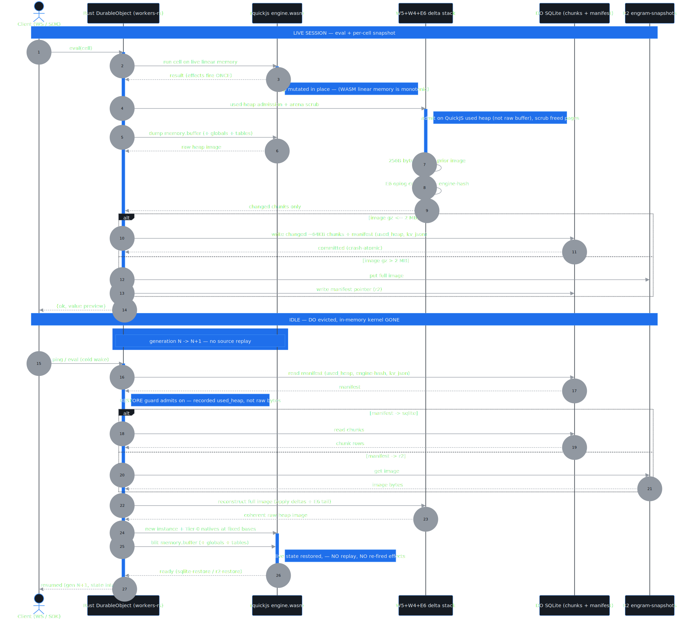

# Engram

**A durable, hibernating, multi-tenant JavaScript / TypeScript REPL kernel on Cloudflare.**

> **▶ Live demo:** **<https://engram-ui.umg-bhalla88.workers.dev>** — a browser notebook on the live kernel.
> Or in a terminal: `engram repl` (every line evaluates on the remote durable kernel; type TypeScript directly).
> Kernel WS endpoint: `wss://engram-kernel.umg-bhalla88.workers.dev`.

Engram runs untrusted / agent-authored JavaScript in a sandboxed [QuickJS](https://github.com/quickjs-ng/quickjs) interpreter compiled to WASM, hosted inside a Cloudflare Durable Object. A session keeps a **live interpreter namespace** — variables, closures, pending promises, injected stdlib — that **survives idle eviction and cold restart with no replay and no re-fired side effects**, because the entire interpreter heap is snapshotted to durable storage and blitted back on wake.

It is a Jupyter/IPython-kernel for the edge: a REPL that sleeps when idle and resumes with full live state. On top of that core it ships a codemode/RLM execution backend, per-tenant auth + metering, an SDK, a CLI, and a browser notebook.

> **Provenance.** Formerly `montydyn`, renamed to **Engram** on the rebrand — the heap snapshot *is* an engram, a memory trace. The on-disk folder stays `montydyn/`; brand, repo, and deployed worker names changed.

---

## The core bet (why this is even possible)

V8 isolates **cannot** hibernate a live kernel — there is no heap-snapshot API. A Cloudflare Worker's JS heap dies on eviction; the only way back is replaying source, which re-fires every side effect.

**Rust → WASM dissolves that.** A WASM interpreter holds all its state in **linear memory — a plain `ArrayBuffer` you can read, persist, and restore.** So:

- **Hibernate** = dump `memory.buffer` (+ mutable globals like `__stack_pointer`) to durable storage.
- **Resume** = new WASM instance, blit the bytes back, continue execution mid-namespace.

No journaling, no source replay. We literally persist the heap. That single property is the whole product.

<p align="center"></p>

---

## What works today

- **Stateful multi-cell REPL.** Heap persists across evals: closures, namespaces, arrays, `>1MB` host context all survive eviction and reload byte-for-byte (`restoreSource = sqlite-restore`).
- **Durable hibernation.** Proven across **real 20-minute full evictions, 7/7 cycles, zero state loss**. Deep cold-wake ~1.5s worst case — dominated by platform WS-connect / DO spin-up, **not** our restore (QuickJS init <300µs, gunzip + blit sub-ms).
- **Determinism.** Seeded clock (epoch + 1ms tick) and seeded RNG (mulberry32) externalized at the host boundary → byte-identical snapshots across restore. Entropy counters persisted.
- **Hardening / isolation.** Native-C giant-alloc backstop (dlmalloc malloc-limit, 16MB live-heap ceiling) turns OOM into a **catchable typed error before `memory.grow` can crash the DO** — the old WS-1006 hole is closed. Loop tick-budget preempts infinite loops, socket stays alive. Mid-cell heap tripwire. 18MB snapshot-dump ceiling with clean typed rejection (no silent crash).
- **Engine-migration journal.** On QuickJS engine-hash mismatch, replays per-cell sources instead of bricking (best-effort; faithful for pure cells, effectful cells flagged).
- **stdlib + web extensions.** Pure-JS libs (lodash/dayjs/zod/ramda/uuid/…) esbuilt and evaled into the heap at create, snapshot-persisted. Tier-0 quickjs-wasi extensions live in the VM: `crypto.subtle` / `getRandomValues` / `randomUUID`, `TextEncoder`/`Decoder`, `URL`/`URLSearchParams`, `structuredClone`, `Headers`.
- **Network egress.** `host.fetch(url, init)` → DO-side `fetch()`, allowlist-enforced (`config.fetch`: `false` / `true` / `[hosts]`), eval is async so cells can `await`.
- **Codemode / RLM.** Host-side context store (`host.ctx.*`, chunked, multi-MB), `host.subLM`, `host.final`, and bounded **lambda-RLM** combinators (SPLIT/MAP/REDUCE — terminating). Code Mode `execute()` drop-in. Depth-1 RLM loop resolved a 4.36MB-context needle via host-side slicing.
- **Multi-tenant.** SupervisorDO with 64-shard / 128-facet-per-shard routing (FNV-1a); per-session KernelFacet with its **own isolated SQLite**, cold-restore across `facets.abort`, failure-isolation proven. WS-hibernation **proxy model** (supervisor holds the socket and RPCs each frame — facet-held sockets are broken on the platform). Per-tenant API-key auth + Analytics Engine metering + `/usage`.
- **Surfaces.** Browser notebook UI, `@engram/sdk` (Node), `engram` CLI (REPL + RLM loop), agent code-mode adapter.

---

## Deployed surface

| Surface | URL / artifact | Source dir | What |
|---|---|---|---|
| Notebook UI | `engram-ui.umg-bhalla88.workers.dev` | `apps/ui/` | zero-dep browser REPL + RLM demo; defaults to engram-kernel |
| Kernel | `engram-kernel.umg-bhalla88.workers.dev` | `apps/kernel/` | **rquickjs-Rust kernel** — durable REPL, W5/W4/E6 durability, guards, Tier-0, normal-JS persistence. The hand-written JS brain is gone. |
| Cloud (multi-tenant) | `engram-cloud` | `apps/cloud/` | sharded supervisor, per-tenant auth, `/eval`, `/usage` |
| SDK / CLI | `@engram/sdk`, `engram` | `packages/{sdk,cli}` | **not yet npm-published** (owner-gated) |

Storage: R2 `engram-snapshots`, Analytics Engine dataset `montydyn_kernel`. Workers **Paid** plan required (Worker Loader / Dynamic Workers / facets).

---

## Quick start

### Notebook (no install)

Open `https://engram-ui.umg-bhalla88.workers.dev`. Endpoint + API key persist in `localStorage`. Type cells, run, watch state survive a reload.

### HTTP / WS against the kernel

```bash
# health
curl https://engram-kernel.umg-bhalla88.workers.dev/health

# create a session + eval over WS — see packages/sdk for the framed protocol
```

Frame protocol (kernel WS):
- `{t:"create", config}` — start a session. `config`: `{clock, rngSeed, capture, cellBudgetTicks, fetch, tools, modules}`. Persisted across cold wake.
- `{t:"eval", code}` — eval a cell, returns `{ok, value|error, console, valueType}`.
- `{t:"ping"}` / `{t:"gen"}` — liveness / generation probe (no instantiate cost).

### SDK

```js
import { Engram } from "@engram/sdk";          // packages/sdk
const s = await Engram.connect({ url, apiKey });
await s.eval("globalThis.x = 41");
await s.eval("x + 1");                          // → 42, survives eviction
```

### CLI

```bash
node packages/cli/engram.mjs repl --url <kernel-url>   # durable REPL
node packages/cli/engram.mjs rlm  --context big.txt --q "find the needle"
```

---

## Repository layout

```
README.md / CLAUDE.md (≡ AGENTS.md)   ── source of truth + full context trail
apps/kernel/                          ── kernel (engram-kernel) — rquickjs-Rust, the brain
  src/lib.rs        Rust DO shell · engine/src/lib.rs  Rust engine (eval/snapshot/guards/W4 delta)
  src/kernel-glue.mjs  ~400 lines WASI/DO plumbing only (no business logic)
apps/cloud/                           ── multi-tenant SaaS (engram-cloud) — Rust facets (supervisor-rust.js)
apps/ui/                              ── notebook SPA (engram-ui)
packages/sdk/                         ── @engram/sdk v2 — dev-friendly: typed, auto-reconnect, examples
packages/cli/                         ── engram CLI
tests/{kernel-rust,sdk,kernel,ui}/    ── gate/smoke harnesses (out of app/lib code)
experiments/                          ── FROZEN proof archive: the JS→Rust journey, every gate/bake-off
context/                              ── external repos (shallow submodules; see include.md)
docs/                                 ── feasibility, ADRs, per-version + research/convergence results
```

> **The kernel is Rust.** The JS-glue kernel was cut over to rquickjs-Rust (decision B,
> `docs/RUST-KERNEL-PLAN.md` → `RUST-FINAL-GATE.md` → live). The whole platform — kernel + cloud facets —
> runs one Rust kernel; no hand-written JS brain anywhere. `experiments/` is the frozen JS→Rust record.

> **Experiments + the v1-facet spike were deleted** once their findings shipped (multi-tenant landed in `apps/cloud`). The proofs live as write-ups in `docs/results/exp-*.md` + `v1-facet-spike.md`; recover the code from git history if ever needed.

> **Older kernels `v0`→`v0.8` were pruned from the working tree** to keep it lean. Recover any from git history or the `v0.N-milestone` tags.

> **Tracked `.wasm` are intentional.** `*.wasm` is gitignored but `quickjs.wasm` + Tier-0 extension `.wasm` are force-added: **workerd forbids runtime `WebAssembly.compile` of raw bytes**, so the pre-compiled module ships in-repo as a CompiledWasm import. Not a build artifact mistake.

---

## How it works (deeper)

<p align="center"></p>

<p align="center">
  
  &nbsp;&nbsp;
  
</p>

> Diagrams are now [Mermaid](https://mermaid.js.org/) — source is the sibling `.mmd` in `docs/diagrams/`; render with `npx @mermaid-js/mermaid-cli -i docs/diagrams/<key>.mmd -o docs/diagrams/<key>.svg -b "#0d1117"`.

### Snapshot / restore
1. After a cell evals, the Rust DurableObject reads `memory.buffer`, mutable globals, and entropy counters from the rquickjs `engine.wasm` instance.
2. Guard admits on **used heap** (`getMemoryUsage().memoryUsedSize`), not the monotonic buffer size — so a spike-then-free session can still checkpoint.
3. Image gzipped → SQLite (chunked 64KB rows + manifest) when `<2MB gz`, else R2 overflow. Checkpoint replace is crash-atomic via workerd write-coalescing (raw `BEGIN/COMMIT` is forbidden on DO SQLite).
4. On wake: new WASM instance, Tier-0 natives re-instantiated at fixed bases, heap bytes blitted back, globals restored. Execution continues mid-namespace.

### Determinism boundary
All non-determinism (time, RNG, crypto entropy) crosses a single host boundary and is seeded + counted. Same seed + same cells ⇒ byte-identical snapshot, verified across real eviction. `host.fetch` adds zero entropy to the snapshot.

### Guards (defense in depth)
| Guard | Limit | Failure mode |
|---|---|---|
| Loop tick-budget | 1200 default / 2000 cap | typed `TimeoutError`, socket alive |
| Mid-cell heap tripwire | +8MB growth / 16MB absolute | typed `MemoryLimitError` mid-cell |
| Native malloc-limit (dlmalloc) | 16MB live heap | typed `NativeAllocLimitError` (no WS-1006) |
| Snapshot-dump ceiling | 18MB raw | typed `SizeAdmissionError`, clean reject |
| Engine-hash | build-time `quickjs.wasm` SHA-256 | journal replay on mismatch |

---

## Operating envelope (measured)

- **Eval latency:** p50 ~255ms; warm UI evals ~220–300ms. Tail p99 ~3–4.4s on cold-facet WASM instantiate.
- **Cold wake:** base ~130ms; 5MB image ~1.5–1.8s; 20-min deep eviction ~1.5s — **platform-bound** (WS connect + DO spin-up), not in-kernel.
- **Throughput:** linear to ~146 evals/s at 150 concurrent sessions; **0% error, 100% state-correctness** at 80/120/150 concurrent.
- **Live heap ceiling:** 16MB/cell (below the 18MB dump ceiling; above the ~7MB stdlib envelope). Bigger working sets must chunk across cells.
- **Host args:** 8MB inbound/outbound; `host.ctx.slice/get` capped at 1MB.
- **Routing:** 64 shards × 128 facets; cap hit ⇒ typed rejection (no crash).
- **Snapshot size:** ~740KB gz for a typical warm session.

Full numbers: `docs/results/SUMMARY.md`.

---

## Status & remaining gaps (honest)

**Product complete** as a durable, hibernating, multi-tenant codemode/RLM REPL platform — kernel + auth/metering + lambda-RLM + agent mode + SDK + CLI + UI, scale-validated, known holes closed.

**Not done (owner-gated or out of scope):**
1. **npm publish** of `@engram/sdk` + CLI — built, needs owner OK.
2. **Scale at 1000s** — verified to 150 concurrent; full 64×128 saturation under sustained load unproven.
3. **Docs site** — internal result docs only; no public quickstart/API reference.
4. **R2 stale-key prune** — old `montydyn-snapshots` bucket already deleted; `engram-snapshots` is live.
5. **Python kernel** — **dropped** per owner. RustPython was the candidate (single-memory, snapshottable); Pyodide is blocked on CF.

**Carried risks:** engine-migration journal is best-effort (effectful cells can't replay faithfully and are flagged — heap-snapshot remains the real durability mechanism); effectful-cell detection is a conservative host-side substring scan; lambda-RLM single-leaf bound bug fixed in `apps/kernel/stdlib-src/lambda.js`.

---

## Codebase introspection

DATA from a four-report structural audit (full ranked action table: [`docs/INTROSPECTION.md`](docs/INTROSPECTION.md)).

**Supply chain — external engine, original shell.** The live JS engine is **not original**: it is the npm package **`quickjs-wasi@3.0.0`** (vercel-labs). Everything Engram-authored is the host shell around it — `apps/kernel/src/lib.rs` (Rust DO, 1576 LOC), `apps/kernel/src/glue.js` (host↔VM glue, 2016 LOC), the supervisor/facet kernel, sdk, cli.

**The kernel/cloud WASM asymmetry.** Same engine, two provenance paths:

| | kernel | cloud |
|---|---|---|
| `quickjs-wasi` dep | yes (`@3.0.0`) | **none** |
| engine source | **derived** from npm at build | **vendored, git-tracked bytes** |
| `quickjs.wasm` | gitignored, `-Oz`, 1.45MB | tracked, raw 1,586,981 B |
| delivery | CompiledWasm + Rust wasm-bindgen | base64-bake into a `{wasm}` Worker-Loader module |

Cloud has no dep so it can't derive — it vendors 10 tracked binaries (~2.8MB); kernel tracks zero. Risk: no version pin links the two paths → silent engine divergence.

- **`glue.js` is 2016 lines / ~100KB, but 54% is prose.** 645 comment-only lines = 53,852 B (54.0%) are an inline append-only changelog (version tags, BUG-1..6, GUARD/GAP notes). The rest is a host-program-**plus-embedded-guest-program** (`REBIND_SRC` + other eval'd VM strings) spanning ~12 orthogonal subsystems that were never modularized.
- A module split is **cosmetic for the shipped artifact** — esbuild/wrangler bundle to one file; justify on maintainability only. Any byte-shifting reformat invalidates live snapshots via `EngineHashMismatchError`.

---

## Docs

| File | What |
|---|---|
| `CLAUDE.md` | source of truth: full context trail, journey, milestones, key facts |
| `docs/DESIGN.md` | **deep internals** — layering, eval lifecycle, snapshot/restore, state machine, guards, multi-tenant containment (text-first diagrams) |
| `docs/feasibility.md` | feasibility study + architecture (verdict, snapshot mechanism, risks) |
| `docs/experiments.md` | the 10-experiment phased plan |
| `docs/decisions.md` | ADRs — 0001 drop Dynamic Worker Loader · 0002 heap-snapshot · 0003 facets-for-V1 |
| `docs/v0.1-design.md` | dynamically-configured stateful JS env spec |
| `docs/results/SUMMARY.md` | operating envelope (all hard numbers) |
| `docs/results/*.md` | per-experiment + per-version build reports |
| `docs/research/*.md` | cold-start, env-surface, RLM/codemode research |
| `docs/PRODUCT.md` | product-state snapshot |

---

## Conventions

- **Source of truth:** `CLAUDE.md` (≡ `AGENTS.md` symlink). Update `## Status` + `docs/` as work lands.
- **Branches:** one per experiment/feature (`exp/<n>-<slug>`, `feat/<slug>`); PR into `main`, never commit experiments directly.
- **Secrets:** Cloudflare creds in `.env` (gitignored — never committed). See `.env.example`.
- **Worktrees:** parallel agents use isolated git worktrees.
- **`context/`:** external repos as shallow submodules (read-only). Init: `git submodule update --init --depth 1`.

## Key platform facts (do not re-derive)

- **V8 isolate heap: not snapshottable. WASM linear memory: is.** ← the whole bet.
- Durable Object: single-threaded per id; SQLite survives everything; alarms; WS Hibernation (in-memory state lost on hibernate → must live in storage). **Facets cannot set alarms** → idle/TTL scheduling lives on the supervisor DO.
- Worker Loader / Dynamic Workers / facets require Workers **Paid**; wrangler **≥ 4.86.0**.
- workerd forbids runtime WASM compile of raw bytes → deliver via CompiledWasm import or the `{wasm}` Worker-Loader module type.
